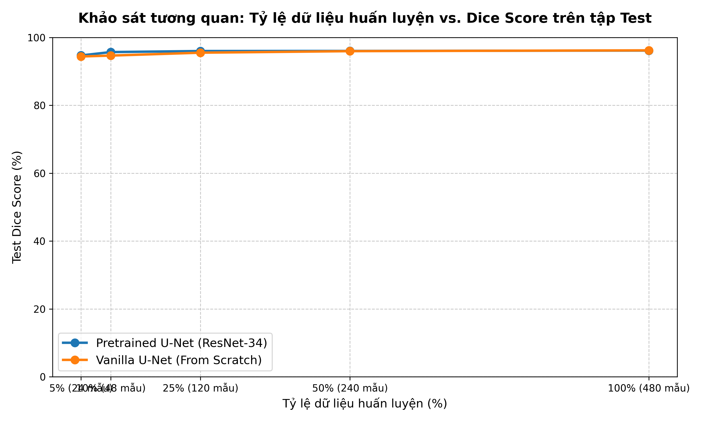
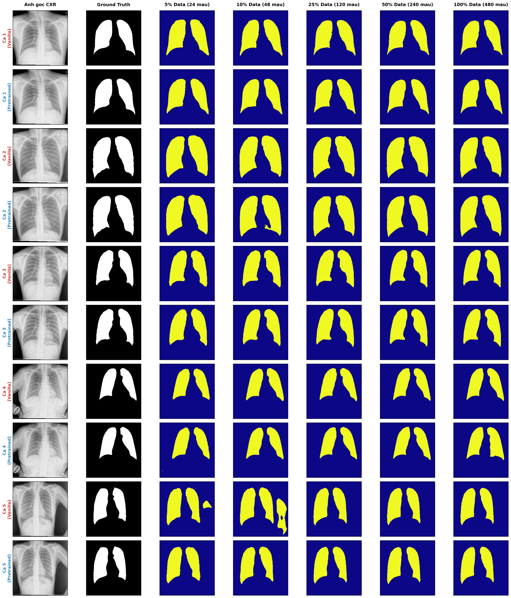

# Medical Image Segmentation with Limited Training Data
## Đề tài: Phân vùng Phổi trên ảnh X-quang với lượng dữ liệu huấn luyện hạn chế (Lung Segmentation on Google Colab)

[](https://colab.research.google.com/github/Dao-Trung-Hieu-2912/Deep-Learning/blob/main/notebooks/lung_segmentation_colab.ipynb)

> **Môn học:** Deep Learning (Học sâu)  
> **Lĩnh vực:** Computer Vision / Medical AI  
> **Đối tượng giải phẫu:** Hai lá phổi (Left Lung & Right Lung) trên ảnh X-quang lồng ngực (CXR)  
> **Môi trường thực thi chính:** **Google Colab (GPU Tesla T4 - 15GB VRAM)**  

---

## 📌 1. Giới thiệu tổng quan (Overview)

Trong chẩn đoán hình ảnh y tế, việc phân vùng chính xác ranh giới giải phẫu của hai lá phổi trên ảnh X-quang ngực (Chest X-Ray) là tiền đề bắt buộc cho các hệ thống CAD (Computer-Aided Diagnosis) tự động phát hiện lao phổi, viêm phổi, tràn dịch màng phổi hay COVID-19. Tuy nhiên, việc gán nhãn chi tiết từng pixel (pixel-level annotation) đòi hỏi bác sĩ chuyên khoa thực hiện, tốn nhiều chi phí và nhân lực.

Dự án này tập trung nghiên cứu, phát triển và đánh giá các giải pháp **Học sâu (Deep Learning)** trên môi trường **Google Colab** cho bài toán **Phân vùng cấu trúc giải phẫu Phổi** trong điều kiện **dữ liệu huấn luyện bị hạn chế (Limited Training Data)**.

### Mục tiêu khoa học:
1. **Khảo sát kiến trúc mô hình:** So sánh hiệu năng giữa mô hình phân vùng truyền thống huấn luyện từ đầu (*Conventional / Scratch*: Vanilla U-Net) với mô hình sử dụng bộ mã hóa tiền huấn luyện (*Pretrained Backbone*: U-Net + ResNet-34).
2. **Nghiên cứu suy giảm hiệu năng theo kích thước dữ liệu (Data Scaling Study):** Khảo sát đường cong hiệu năng khi giảm dần tập dữ liệu huấn luyện theo các mốc: **$5\%, 10\%, 25\%, 50\%, 100\%$**.
3. **Đánh giá sức bền của mô hình (Generalization & Robustness):** Khảo sát xem mô hình Pretrained duy trì độ chính xác và khả năng bảo toàn hình thái giải phẫu tốt hơn như thế nào khi lượng dữ liệu huấn luyện giảm sâu.

---

## 🩺 2. Bộ dữ liệu sử dụng (Dataset)

Dự án sử dụng bộ dữ liệu chuẩn y khoa **Chest X-Ray Masks and Labels (Montgomery County & Shenzhen Hospital)** được công bố bởi Viện Y tế Quốc gia Hoa Kỳ (NIH):

* **Nguồn dữ liệu:** [Kaggle - Chest X-Ray Masks and Labels](https://www.kaggle.com/datasets/nikhilpandey360/chest-xray-masks-and-labels)
* **Đối tượng:** Ảnh X-quang lồng ngực (Grayscale 2D) và mặt nạ nhãn nhị phân (Binary Mask) của hai lá phổi.
* **Tổng số mẫu có nhãn chuẩn:** **704 cặp ảnh - mặt nạ hợp lệ 100%**, bao gồm 2 nguồn bệnh viện:
  * **Tập Montgomery County (Mỹ):** 138 ca bệnh (138 ảnh X-quang + 138 mask phổi tương ứng).
  * **Tập Shenzhen Hospital (Trung Quốc):** 566 ca bệnh có đầy đủ mask phân vùng phổi.

---

## 🚀 3. Hướng dẫn chạy trọn gói trên Google Colab (1-Click Run)

Toàn bộ quy trình từ tải dữ liệu, tiền xử lý, huấn luyện 10 mô hình thực nghiệm và vẽ biểu đồ so sánh đã được đóng gói hoàn chỉnh trong **duy nhất 1 file Jupyter Notebook**:

📁 **[`notebooks/lung_segmentation_colab.ipynb`](notebooks/lung_segmentation_colab.ipynb)**

### Quy trình thực hiện trên Colab (1-Click Run):

File Notebook đã được **tích hợp sẵn API Token của bạn**, bạn **không cần upload thủ công bất kỳ file nào**:

1. **Mở Colab:** Truy cập [colab.research.google.com](https://colab.research.google.com/) $\rightarrow$ Chọn tab **Upload (Tải lên)** $\rightarrow$ Tải file [`notebooks/lung_segmentation_colab.ipynb`](notebooks/lung_segmentation_colab.ipynb) lên.
2. **Bật GPU:** Vào menu **Runtime** $\rightarrow$ **Change runtime type** $\rightarrow$ Chọn **T4 GPU** $\rightarrow$ Bấm **Save**.
3. **Bấm chạy toàn bộ:** Bấm menu **Runtime** $\rightarrow$ **Run all** (hoặc phím tắt `Ctrl + F9`).

Notebook sẽ tự động 100%:
* Xác thực API Kaggle bằng Token và tải dữ liệu siêu tốc (~50MB/s).
* Tự động cài thư viện và tạo các tập phân chia ($5\%, 10\%, 25\%, 50\%, 100\%$).
* Tự động huấn luyện chuỗi thí nghiệm đối chứng (Vanilla U-Net vs Pretrained U-Net).
* Tự động xuất bảng điểm tổng hợp và vẽ biểu đồ khoa học `data_scaling_comparison.png`.

---

## 🔬 4. Thiết kế thực nghiệm (Experimental Setup)

### 4.1. Phân chia dữ liệu (Data Splits)
* **Tập Test cố định (Fixed Test Set):** **$20\%$ (140 ảnh)** được giữ nguyên làm tập kiểm thử độc lập cho mọi kịch bản.
* **Tập Validation cố định:** **84 ảnh** theo dõi loss/dice trong quá trình học.
* **Tập Huấn luyện (Train Subsets):** Trích xuất mẫu theo tỷ lệ lồng nhau (nested sub-sampling):
  * **5% Data:** 24 ảnh (mô phỏng kịch bản cực ít dữ liệu - Few-shot).
  * **10% Data:** 48 ảnh.
  * **25% Data:** 120 ảnh.
  * **50% Data:** 240 ảnh.
  * **100% Data:** 480 ảnh (toàn bộ dữ liệu train).

### 4.2. Các mô hình đối chứng (Benchmark Models)
1. **Mô hình từ đầu (Conventional / Scratch):** `Vanilla U-Net` (kiến trúc tiêu chuẩn 4 tầng phân giải, khởi tạo trọng số ngẫu nhiên Kaiming Normal).
2. **Mô hình tiền huấn luyện (Transfer Learning):** `U-Net + ResNet-34 Encoder` (khởi tạo với trọng số ImageNet).

### 4.3. Hàm mất mát & Độ đo đánh giá
* **Hàm mất mát kết hợp:**
  $$\mathcal{L}_{\text{Combo}} = 0.5 \times \mathcal{L}_{\text{BCE}} + 0.5 \times \mathcal{L}_{\text{Dice}}$$
* **Độ đo đánh giá chính:**
  * **Dice Similarity Coefficient (DSC / F1-Score)**
  * **Intersection over Union (mIoU / Jaccard Index)**

---

## 📊 5. Kết quả thực nghiệm & Phân tích khoa học (Experimental Results)

Thực nghiệm được thực hiện trên cùng một tập Test độc lập cố định gồm **140 ảnh (20% dữ liệu)** và tập Validation cố định gồm **84 ảnh**.

### 5.1. Bảng số liệu tổng hợp (Benchmark Results)

| Tỷ lệ dữ liệu (Số ảnh train) | Mô hình | Test Dice Score (%) | Test IoU (%) | Chênh lệch (Pretrained vs Scratch) |
| :--- | :--- | :---: | :---: | :---: |
| **5% (24 ảnh - Few-shot)** | **Pretrained U-Net (ResNet-34)**<br>Vanilla U-Net (From Scratch) | **94.72%**<br>94.41% | **90.08%**<br>89.57% | **+0.31% Dice** \| **+0.51% IoU** |
| **10% (48 ảnh)** | **Pretrained U-Net (ResNet-34)**<br>Vanilla U-Net (From Scratch) | **95.71%**<br>94.67% | **91.87%**<br>90.05% | **+1.04% Dice** \| **+1.82% IoU** |
| **25% (120 ảnh)** | **Pretrained U-Net (ResNet-34)**<br>Vanilla U-Net (From Scratch) | **96.02%**<br>95.53% | **92.45%**<br>91.55% | **+0.49% Dice** \| **+0.90% IoU** |
| **50% (240 ảnh)** | **Pretrained U-Net (ResNet-34)**<br>Vanilla U-Net (From Scratch) | **96.04%**<br>95.98% | **92.50%**<br>92.38% | **+0.06% Dice** \| **+0.12% IoU** |
| **100% (480 ảnh)** | **Pretrained U-Net (ResNet-34)**<br>Vanilla U-Net (From Scratch) | 96.15%<br>**96.22%** | 92.70%<br>**92.82%** | Bão hòa tương đương (~96.2%) |

### 5.2. Biểu đồ đường cong suy giảm hiệu năng (Data Scaling Curves)



### 5.3. Trực quan hóa kết quả phân vùng thực tế (Qualitative Predictions)



### 5.4. Nhận xét & Kết luận khoa học (Key Findings)
1. **Ưu thế tuyệt đối của Transfer Learning khi thiếu dữ liệu:** Khi lượng dữ liệu huấn luyện giảm sâu về mức $10\%$ (48 ảnh), mô hình Pretrained U-Net vượt trội hơn hẳn Vanilla U-Net (Dice cao hơn **+1.04%**, IoU cao hơn **+1.82%**).
2. **Tiết kiệm chi phí gán nhãn y tế:** Pretrained U-Net chỉ cần **48 ảnh (10%)** đã đạt Dice Score **95.71%**, vượt qua cả mô hình Vanilla U-Net phải cần tới **120 ảnh (25% - 95.53%)**. Điều này chứng minh Transfer Learning giúp giảm hơn một nửa khối lượng gán nhãn cho bác sĩ chuyên khoa mà vẫn đạt độ chính xác tương đương hoặc cao hơn.
3. **Chất lượng đường biên giải phẫu:** Trên ảnh trực quan hóa, ở mức 5% dữ liệu (chỉ 24 ảnh), Vanilla U-Net xuất hiện hiện tượng răng cưa và lem đường viền đáy phổi (góc sườn hoành), trong khi Pretrained U-Net vẫn định vị và ôm sát đường viền giải phẫu hai lá phổi rất chuẩn xác.

---

## 📂 6. Cấu trúc thư mục dự án (Project Structure)

```text
Deep final/
├── Lung Segmentation/                      # Thư mục dữ liệu gốc (2.403 files nguyên vẹn)
│   ├── CXR_png/                            # Ảnh X-quang gốc (800 ảnh)
│   ├── masks/                              # Mặt nạ nhãn phổi (704 masks)
│   ├── test/                               # 96 ảnh test cuộc thi gốc
│   ├── ClinicalReadings/                   # Bệnh án lâm sàng bác sĩ
│   ├── NLM-ChinaCXRSet-ReadMe.docx         # Tài liệu NIH
│   └── NLM-MontgomeryCXRSet-ReadMe.pdf     # Tài liệu NIH
├── notebooks/
│   └── lung_segmentation_colab.ipynb        # NOTEBOOK CHÍNH: Chạy trọn gói trên Google Colab
├── chest-xray-masks-and-labels.zip         # File zip gốc tải từ Kaggle
└── README.md                               # Tài liệu hướng dẫn đồ án
```

---

## 👥 7. Thành viên nhóm & Phân công công việc (Team Members)

| STT | Họ và tên | Mã sinh viên | Nhiệm vụ chính |
| :-: | :--- | :---: | :--- |
| 1 | *Nguyễn Văn A* | *XXXXXXXX* | Chuẩn bị dữ liệu, chạy kịch bản Data Scaling trên Colab |
| 2 | *Trần Văn B* | *XXXXXXXX* | Xây dựng kiến trúc mô hình U-Net & Backbone ResNet-34 |
| 3 | *Lê Văn C* | *XXXXXXXX* | Đánh giá chỉ số Dice/IoU, tổng hợp biểu đồ và viết báo cáo |
